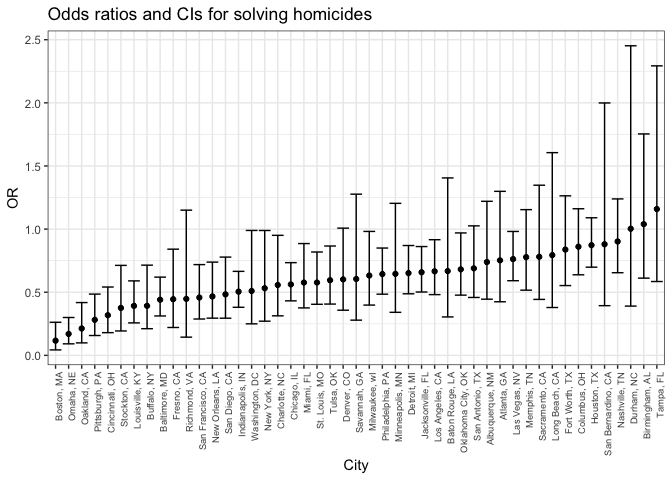

P8105\_hw6\_xy2395
================
Jack Yan
11/16/2018

Problem 1
=========

Data manipulation
-----------------

Import the data and do some tidying per problem requirement.

``` r
homicide_df = 
  read_csv("./data/homicide-data.csv") %>% 
  # Create a city_state variable
  mutate(city_state = str_c(city, ", ", state),
         # Create a binary variable indicating whether the homicide is solved
         resolved = as.numeric(disposition == "Closed by arrest")) %>% 
  # Omit some cities
  filter(!city_state %in% c('Dallas, TX', 'Phoenix, AZ', 'Kansas City, MO', 'Tulsa, AL')) %>% 
  # Modifiy victim_race to have categories white and non-white, with white as the reference category. 
  filter(victim_race != "Unknown") %>% 
  mutate(victim_race = if_else(victim_race == "White", "white", "non-white"),
         victim_race = fct_relevel(victim_race, "white")) %>%
  # Be sure that victim_age is numeric
  mutate(victim_age = as.numeric(victim_age))
```

Fit a logistic regression for Baltimore, MD
-------------------------------------------

``` r
# fit a logistic regression
fit_logistic = 
  homicide_df %>% 
  filter(city_state == "Baltimore, MD") %>% 
  glm(resolved ~ victim_age + victim_sex + victim_race, data = ., family = binomial())

# obtain the estimate of OR
estimate =
  fit_logistic %>% 
  broom::tidy() %>% 
  mutate(OR = exp(estimate)) %>%
  # the estimate givrn by the model is log odds ratio
  select(term, log_OR = estimate, OR, p.value) %>% 
  filter(str_detect(term, "non-white") == TRUE)

# obtain the CI 
ci =
  confint(fit_logistic) %>% broom::tidy() %>% 
  mutate('95%_CI_lower' = exp(X2.5..),
         '95%_CI_upper' = exp(X97.5..)) %>% 
  filter(str_detect(.rownames, "non-white") == TRUE)

# combine the estimate and CI 
bind_cols(estimate, ci) %>% 
  mutate(city = "Baltimore, MD") %>% 
  select(city, OR, `95%_CI_lower`, `95%_CI_upper`) %>% 
  knitr::kable(digits = 3)
```

| city          |     OR|  95%\_CI\_lower|  95%\_CI\_upper|
|:--------------|------:|---------------:|---------------:|
| Baltimore, MD |  0.441|           0.312|            0.62|

Iteration
---------

First build a function for fitting a glm and calculating the estimates and CIs.

``` r
# build a function with city_state specific data as the input
run_glm <- function(data_subset){
  # fit a logistic regression
  fit_logistic = 
    glm(resolved ~ victim_age + victim_sex + victim_race, data = data_subset, family = binomial())
  
  # obtain the estimate of OR
  estimate =
    fit_logistic %>% 
    broom::tidy() %>% 
    mutate(OR = exp(estimate)) %>%
    # the estimate given by the model is log odds ratio
    select(term, log_OR = estimate, OR, p.value) %>% 
    filter(str_detect(term, "non-white") == TRUE)
  
  # obtain the CI of OR
  ci =
  suppressWarnings(
    confint(profile(fit_logistic)) %>% broom::tidy() %>% 
    mutate('95%_CI_lower' = exp(X2.5..),
           '95%_CI_upper' = exp(X97.5..)
    ) %>% 
    filter(str_detect(.rownames, "non-white") == TRUE)
  )
  
  # conbine columns 
  bind_cols(estimate, ci) %>% 
    select(OR, `95%_CI_lower`, `95%_CI_upper`)
}
```

Then iterate among the `city_state`s in a tidy pipeline.

``` r
result_df = 
  homicide_df %>% 
  group_by(city_state) %>% 
  nest() %>%
  mutate(result = map(data, run_glm)) %>% 
  select(-data) %>% 
  unnest()
```

Create a plot that shows the estimated ORs and CIs for each city. Organize cities according to estimated OR, and comment on the plot.

``` r
result_df %>% 
  mutate(city_state = fct_reorder(city_state, OR)) %>% 
  ggplot(aes(x = city_state, 
             y = OR, 
             ymin = `95%_CI_lower`, 
             ymax = `95%_CI_upper`)
  ) +
    geom_point() +
    geom_errorbar() +
    theme_bw() +
    theme(axis.text.x = element_text(angle = 90, hjust = 1, size = rel(0.8))) +
    labs(
      x = "City",
      y = "OR",
      title = "Odds ratios and CIs for solving homicides"
    )
```



Comment:

For most of the cities, the estimates for odds ratio are below 1.0, and 1.0 are not included in their 95% confidence intervals, showing significantly lower estimated odds of solving homicides among non-white victims compared with white victims for those cities. The confidence intervals for some cities (such as Boston, MA) are narrow, so we can be more confident about future predictions for these cities.

Problem 2
=========

Data manipulation
-----------------

Import the data, and convert some numeric variables to categorical according to the dataset description.

``` r
weight_df = 
  read_csv("./data/birthweight.csv") %>% 
  mutate(
    babysex = as.factor(babysex),
    frace = as.factor(frace),
    malform = as.factor(malform),
    mrace = as.factor(mrace)
  )
```

Fit a model
-----------

### Building my model

First, I checked the correlation among the parameters. The BMI and weight are correlated, and father's race and mother's race are correlated. Those correlated parameters may not be included in the model simultaneously. Then I put all the parameters in the exploratory model, and checked the summary of the fit. I would use all the parameters with p-value &lt; 0.01 as predictors in my model. I also tried adding or deleting some variables to the model, and compared the resulting p-value and adjusted R-squared value. Although the other models I tried are not shown below, my final model gave the highest adjusted R-squared value, and all the predictors in it had p\_values &lt; 0.001.

``` r
cor_matrix = 
  read_csv("./data/birthweight.csv") %>%  
  cor() %>% 
  tidy() %>% select(-pnumlbw, -pnumsga,-bwt) %>% 
  filter(.rownames != "pnumlbw", .rownames != "pnumsga", .rownames != "bwt") 
```

    ## Parsed with column specification:
    ## cols(
    ##   .default = col_integer(),
    ##   gaweeks = col_double(),
    ##   ppbmi = col_double(),
    ##   smoken = col_double()
    ## )

    ## See spec(...) for full column specifications.

    ## Warning in cor(.): the standard deviation is zero

    ## Warning: 'tidy.matrix' is deprecated.
    ## See help("Deprecated")

``` r
fit_all = lm(bwt ~ ., data = weight_df)
summary(fit_all)
```

    ## 
    ## Call:
    ## lm(formula = bwt ~ ., data = weight_df)
    ## 
    ## Residuals:
    ##      Min       1Q   Median       3Q      Max 
    ## -1097.68  -184.86    -3.33   173.09  2344.15 
    ## 
    ## Coefficients: (3 not defined because of singularities)
    ##               Estimate Std. Error t value Pr(>|t|)    
    ## (Intercept) -6265.3914   660.4011  -9.487  < 2e-16 ***
    ## babysex2       28.7073     8.4652   3.391 0.000702 ***
    ## bhead         130.7781     3.4523  37.881  < 2e-16 ***
    ## blength        74.9536     2.0217  37.075  < 2e-16 ***
    ## delwt           4.1007     0.3948  10.386  < 2e-16 ***
    ## fincome         0.2898     0.1795   1.614 0.106551    
    ## frace2         14.3313    46.1501   0.311 0.756168    
    ## frace3         21.2361    69.2960   0.306 0.759273    
    ## frace4        -46.9962    44.6782  -1.052 0.292912    
    ## frace8          4.2969    74.0741   0.058 0.953745    
    ## gaweeks        11.5494     1.4654   7.882 4.06e-15 ***
    ## malform1        9.7650    70.6259   0.138 0.890039    
    ## menarche       -3.5508     2.8951  -1.226 0.220083    
    ## mheight         9.7874    10.3116   0.949 0.342588    
    ## momage          0.7593     1.2221   0.621 0.534418    
    ## mrace2       -151.4354    46.0453  -3.289 0.001014 ** 
    ## mrace3        -91.3866    71.9190  -1.271 0.203908    
    ## mrace4        -56.4787    45.1369  -1.251 0.210901    
    ## parity         95.5411    40.4793   2.360 0.018307 *  
    ## pnumlbw             NA         NA      NA       NA    
    ## pnumsga             NA         NA      NA       NA    
    ## ppbmi           4.3538    14.8913   0.292 0.770017    
    ## ppwt           -3.4716     2.6121  -1.329 0.183913    
    ## smoken         -4.8544     0.5871  -8.269  < 2e-16 ***
    ## wtgain              NA         NA      NA       NA    
    ## ---
    ## Signif. codes:  0 '***' 0.001 '**' 0.01 '*' 0.05 '.' 0.1 ' ' 1
    ## 
    ## Residual standard error: 272.5 on 4320 degrees of freedom
    ## Multiple R-squared:  0.7183, Adjusted R-squared:  0.717 
    ## F-statistic: 524.6 on 21 and 4320 DF,  p-value: < 2.2e-16

``` r
fit_mine = lm(bwt ~ babysex + bhead + blength + delwt + gaweeks + mrace + smoken, data = weight_df)
summary(fit_mine)
```

    ## 
    ## Call:
    ## lm(formula = bwt ~ babysex + bhead + blength + delwt + gaweeks + 
    ##     mrace + smoken, data = weight_df)
    ## 
    ## Residuals:
    ##      Min       1Q   Median       3Q      Max 
    ## -1120.47  -181.53    -6.01   173.39  2338.34 
    ## 
    ## Coefficients:
    ##               Estimate Std. Error t value Pr(>|t|)    
    ## (Intercept) -5814.2727    98.8293 -58.831  < 2e-16 ***
    ## babysex2       29.2229     8.4968   3.439 0.000589 ***
    ## bhead         131.8628     3.4620  38.089  < 2e-16 ***
    ## blength        75.7996     2.0220  37.488  < 2e-16 ***
    ## delwt           2.2667     0.1962  11.553  < 2e-16 ***
    ## gaweeks        11.8658     1.4619   8.117 6.19e-16 ***
    ## mrace2       -146.8837     9.2486 -15.882  < 2e-16 ***
    ## mrace3        -71.6869    42.5050  -1.687 0.091762 .  
    ## mrace4       -120.0461    18.7754  -6.394 1.79e-10 ***
    ## smoken         -4.7516     0.5885  -8.074 8.76e-16 ***
    ## ---
    ## Signif. codes:  0 '***' 0.001 '**' 0.01 '*' 0.05 '.' 0.1 ' ' 1
    ## 
    ## Residual standard error: 274 on 4332 degrees of freedom
    ## Multiple R-squared:  0.7144, Adjusted R-squared:  0.7138 
    ## F-statistic:  1204 on 9 and 4332 DF,  p-value: < 2.2e-16

### Ploting

Show a plot of model residuals against fitted values.

``` r
weight_df %>% 
  add_predictions(fit_mine) %>%
  add_residuals(fit_mine) %>%
  ggplot(aes(y = resid, x = pred)) + 
  geom_point(alpha = 0.25) +
  labs(
      x = "Fitted Value",
      y = "Residual",
      title = "Model residuals against fitted values"
  )
```


Compare my model to two others
------------------------------

### Summary of the two alternative models

``` r
fit_alt_1 = lm(bwt ~ blength + gaweeks, data = weight_df)
fit_alt_2 = lm(bwt ~ bhead*blength*babysex, data = weight_df)

summary(fit_alt_1)
```

    ## 
    ## Call:
    ## lm(formula = bwt ~ blength + gaweeks, data = weight_df)
    ## 
    ## Residuals:
    ##     Min      1Q  Median      3Q     Max 
    ## -1709.6  -215.4   -11.4   208.2  4188.8 
    ## 
    ## Coefficients:
    ##              Estimate Std. Error t value Pr(>|t|)    
    ## (Intercept) -4347.667     97.958  -44.38   <2e-16 ***
    ## blength       128.556      1.990   64.60   <2e-16 ***
    ## gaweeks        27.047      1.718   15.74   <2e-16 ***
    ## ---
    ## Signif. codes:  0 '***' 0.001 '**' 0.01 '*' 0.05 '.' 0.1 ' ' 1
    ## 
    ## Residual standard error: 333.2 on 4339 degrees of freedom
    ## Multiple R-squared:  0.5769, Adjusted R-squared:  0.5767 
    ## F-statistic:  2958 on 2 and 4339 DF,  p-value: < 2.2e-16

``` r
summary(fit_alt_2)
```

    ## 
    ## Call:
    ## lm(formula = bwt ~ bhead * blength * babysex, data = weight_df)
    ## 
    ## Residuals:
    ##      Min       1Q   Median       3Q      Max 
    ## -1132.99  -190.42   -10.33   178.63  2617.96 
    ## 
    ## Coefficients:
    ##                          Estimate Std. Error t value Pr(>|t|)    
    ## (Intercept)            -7176.8170  1264.8397  -5.674 1.49e-08 ***
    ## bhead                    181.7956    38.0542   4.777 1.84e-06 ***
    ## blength                  102.1269    26.2118   3.896 9.92e-05 ***
    ## babysex2                6374.8684  1677.7669   3.800 0.000147 ***
    ## bhead:blength             -0.5536     0.7802  -0.710 0.478012    
    ## bhead:babysex2          -198.3932    51.0917  -3.883 0.000105 ***
    ## blength:babysex2        -123.7729    35.1185  -3.524 0.000429 ***
    ## bhead:blength:babysex2     3.8781     1.0566   3.670 0.000245 ***
    ## ---
    ## Signif. codes:  0 '***' 0.001 '**' 0.01 '*' 0.05 '.' 0.1 ' ' 1
    ## 
    ## Residual standard error: 287.7 on 4334 degrees of freedom
    ## Multiple R-squared:  0.6849, Adjusted R-squared:  0.6844 
    ## F-statistic:  1346 on 7 and 4334 DF,  p-value: < 2.2e-16

#### Cross Validation

``` r
# setup training and testing datasets.
cv_df = 
  crossv_mc(weight_df, n = 100) %>% 
  mutate(train = map(train, as_tibble),
         test  = map(test, as_tibble))

# run the cross validation
cv_df = 
  cv_df %>% 
  mutate(mine  = map(train, ~lm(bwt ~ babysex + bhead + blength + delwt + gaweeks + mrace + smoken, data = .x)),
         alt_1 = map(train, ~lm(bwt ~ blength + gaweeks, data = .x)),
         alt_2 = map(train, ~lm(bwt ~ bhead*blength*babysex, data = .x))
  ) %>% 
  mutate(rmse_mine  = map2_dbl(mine,  test, ~rmse(model = .x, data = .y)),
         rmse_alt_1 = map2_dbl(alt_1, test, ~rmse(model = .x, data = .y)),
         rmse_alt_2 = map2_dbl(alt_2, test, ~rmse(model = .x, data = .y))
  )
```

Plot the distribution of RMSE for the three models.

``` r
cv_df %>% 
  select(starts_with('rmse')) %>% 
  gather(key = model, value = rmse, rmse_mine:rmse_alt_2) %>% 
  mutate(model = str_replace(model, "rmse_", '')) %>% 
  ggplot(aes(x = model, y = rmse)) +
    geom_violin() + 
    labs(
      x = "Model",
      y = "RMSE",
      title = "RMSE for three models"
    )
```


As the plot shows, the first model has the highest overall RMSE, because it is too simple. The second model has a lower RMSE, because it takes into account the interaction among bhead, blength, and babysex. The model I built has the lowest overall distribution of RMSE, showing better prediction accuracy.
